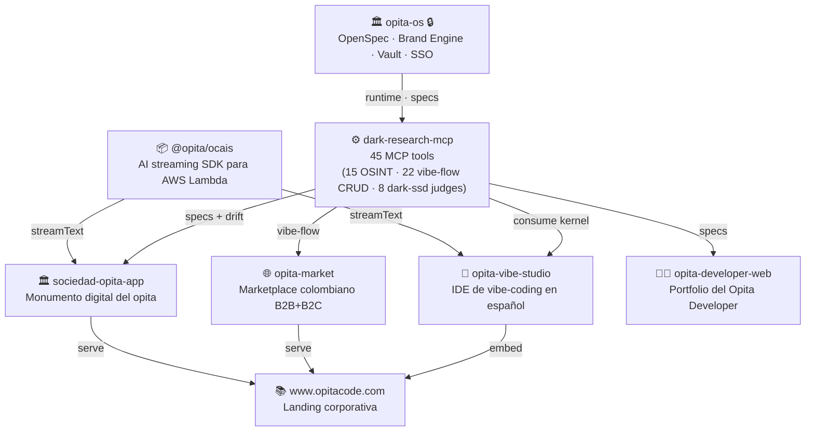

# Opita Code

> 🇨🇴 **Software práctico para negocios reales.** Construido desde Colombia con identidad local y ambición global.
>
> 🇺🇸 **Practical software for real businesses.** Built from Colombia with local identity and global ambition.

---

## 🧠 Nuestro kernel: MCP-research + Vibe-Flow

Toda nuestra organización gira en torno a **un solo par de productos**: **MCP-research** (el servidor MCP que conecta nuestros agentes IA con backends OSINT, vibe-flow CRUD y *dark-ssd* LLM-as-judge) y **Vibe-Flow** (la modalidad de desarrollo: *spec → artifact → drift → reconcile → publish*, con cada cambio versionado en OpenSpec y cada artefacto auditado por un juez LLM antes de publicarse).

El resto de la organización son **productos verticales** que demuestran ese kernel, o **SDKs** que lo extienden. No construimos software sin pasar por el kernel.



---

## ⚙️ El kernel y sus extensiones / The kernel & its extensions

Estos tres repos **son** la organización. El resto son productos verticales que los consumen.

| Capa / Layer | Repositorio | Rol dentro del kernel / Role in the kernel |
|--------------|-------------|---------------------------------------------|
| 🏛️ **Runtime privado** | **[`opita-os`](https://github.com/Opita-Code/opita-os)** 🔒 | La fuente de verdad. Contiene **OpenSpec** (donde viven las specs), el **Brand Engine**, vault encriptado, SSO y Facturación. Es el runtime que sostiene al MCP público. |
| ⚙️ **Kernel MCP público** | **[`dark-research-mcp`](https://github.com/Opita-Code/dark-research-mcp)** | Servidor MCP (Go, stdio) que entrega **45 herramientas** a un agente IA: 15 de OSINT, 22 de vibe-flow CRUD (spec/artifact/drift CRUD), y 8 dark-ssd LLM-as-judge (brand match, compliance, drift detection, grounding, PII, prompt-injection, consensus). SQLite-backed `dark.db` compartido con `dark-eval`. |
| 📦 **SDK de streaming** | **[`ocais`](https://github.com/Opita-Code/ocais)** | **OCAIS — Opita Code AI Stream.** SDK de streaming IA para AWS Lambda (~15 KB, zero deps, TypeScript-first). SSE first-class, AbortSignal + timeoutMs, structured output (Zod), tool execution multi-step. Lo consumen `vibe-studio` y `sociedad-opita-app` para su backend. |

---

## 🛰️ Productos verticales (consumen el kernel) / Vertical products (consume the kernel)

Cada producto demuestra una faceta distinta del kernel. Ninguno se construye fuera de la metodología vibe-flow.

| Producto | Repositorio | Demo en vivo | Qué demuestra del kernel |
|----------|-------------|--------------|---------------------------|
| 🎨 **Vibe Studio** | **[`opita-vibe-studio`](https://github.com/Opita-Code/opita-vibe-studio)** | [vibe.opitacode.com](https://vibe.opitacode.com) | IDE de vibe-coding **en español** para estudiantes y creadores. Browser + desktop (Tauri v2). React 18, SST v4, multi-provider (DeepSeek + Gemini + OpenAI + Anthropic), BYOK. Consume el kernel MCP para governar cada generación. |
| 🌐 **Opita Market** | **[`opita-market`](https://github.com/Opita-Code/opita-market)** | [market.opitacode.com](https://market.opitacode.com) | Marketplace multi-vertical colombiano (B2B+B2C). Dashboard de precios en tiempo real, directorio y comparador. **Astro 6 + SST Router + Aurora Postgres + DynamoDB**. Compliance Ley 1581/2012 (Habeas Data) desde el día 1 — el primer producto donde vibe-flow gates un MVP regulado. |
| 🏛️ **Sociedad Opita** | **[`sociedad-opita-app`](https://github.com/Opita-Code/sociedad-opita-app)** | — | **Monumento digital vivo** del opita (Tello, Huila). Preservación del dialecto con 41 perfiles psicométricos validados (Big Five, Lomnitz, Dunbar) y 10 diálogos en streaming con `@opita/ocais`. Astro 6 + React 19 islands + SST v3 + Hono 4. |
| 🧑‍💻 **Developer Web** | **[`opita-developer-web`](https://github.com/Opita-Code/opita-developer-web)** | — | Portfolio y sitio de identidad del *Opita Developer*. Astro con estética *cyberpunk/gamer*, terminal interactiva, diagramas de arquitectura en vivo. Construido con vibe-flow como vitrina del kernel. |
| 📚 **Web pública** | **[`www.opitacode.com`](https://github.com/Opita-Code/www.opitacode.com)** | [opitacode.com](https://www.opitacode.com) | Superficie pública corporativa. Astro v2 (en migración desde HTML plano) + AWS SAM + Supabase. Magic Link auth compartido con `vibe-ai-backend`. |

---

## 📦 Archivado — reemplazados por `opita-os` / Archived — superseded by `opita-os`

Repos congelados como referencia histórica. La lógica que contenían migró al núcleo privado. No los usamos activamente.

| Repositorio | Estado | Qué contenía / What it contained | Stack |
|-------------|--------|----------------------------------|-------|
| **[`opita-runtime`](https://github.com/Opita-Code/opita-runtime)** | 🔒 archive | Motor de ejecución gobernada. SDD workflow, provider chain, encrypted vault AES-256-GCM, plugin ecosystem con trust classes y risk tiers, 15+ stores. Rewrite in Rust (WIP en `rust-runtime/`). Reemplazado por `opita-os`. | Node.js ESM, Rust (WIP) |
| **[`opita-sync-framework`](https://github.com/Opita-Code/opita-sync-framework)** | 🔒 archive | **Opita Sync Framework (OSF)** — kernel reusable de gobernanza: contracts, policy, runtime, evidence y operator surfaces. Opcional PostgreSQL (persistencia) y Cerbos (PDP). Reemplazado por `opita-os`. | Go 1.24+ |

---

## 🔁 Cómo producimos cada producto / How we ship every product

```
   spec  →  artifact  →  drift  →  reconcile  →  publish
    ↑          ↓            ↓          ↓            ↓
 OpenSpec   log/upload   dark_ssd   spec ↔ artifact   has_disclosure=true
                                                    ↑
                                          dark_ssd_compliance_check
                                          dark_ssd_pii_detect
                                          dark_ssd_prompt_injection_scan
```

### 🇨🇴 Gobernanza de IA
- **MCP-research es nuestro sistema nervioso:** cada agente que escribe código (en OpenSpec, en vibe-studio, en cualquier producto) tiene acceso al mismo set de 45 herramientas MCP — no duplicamos lógica entre repos.
- **Vibe-Flow es nuestra modalidad de desarrollo:** escribimos la *spec* (en OpenSpec) **antes** de generar una sola línea. Cada artefacto se *loggea* con `dark_research_artifact_log`. Un juez LLM (`dark_ssd_drift_judge`) compara artefacto contra spec y emite verdict (`aligned | drift_detected | needs_human`). Sin `reconciled_at`, no hay publish.
- **LLM-as-judge, no LLM-as-author:** publicamos artefactos críticos (synthetic media, contenido EU, código generado) solo después de que un juez LLM los audite contra specs, jurisdicciones y compliance. Cada verdict queda persistido en `sdd_evaluations` para auditoría.

### 🇺🇸 AI Governance
- **MCP-research is our nervous system:** every agent that writes code — whether for OpenSpec, Vibe Studio, or any vertical product — has access to the same 45 MCP tools. We don't duplicate logic across repos.
- **Vibe-Flow is our development modality:** we write the *spec* (in OpenSpec) **before** generating a single line. Each artifact is *logged* via `dark_research_artifact_log`. An LLM judge (`dark_ssd_drift_judge`) compares the artifact against its spec and emits a verdict (`aligned | drift_detected | needs_human`). No `reconciled_at`, no publish.
- **LLM-as-judge, not LLM-as-author:** we publish critical artifacts (synthetic media, EU-jurisdiction content, generated code) only after an LLM judge audits them against specs, jurisdictions, and compliance. Every verdict is persisted in `sdd_evaluations` for audit.

---

## 🌎 Conectá con nosotros / Connect with us

| Canal / Channel | Enlace / Link |
|-----------------|---------------|
| 🌐 **Sitio Web** | [opitacode.com](https://www.opitacode.com) |
| 🧑‍💻 **Founder** | [Nicolás Urrutia](https://www.linkedin.com/in/nicourrutia98/) |
| 📍 **Sede** | Neiva, Huila, Colombia |
| 💬 **WhatsApp** | [wa.me/573126126085](https://wa.me/573126126085) |

---

<p align="center">
  <br>
  © 2026 Opita Code · Juan Nicolás Urrutia Salcedo
  <br>
  <i>Hecho con orgullo colombiano 🇨🇴 · Made in Colombia</i>
</p>